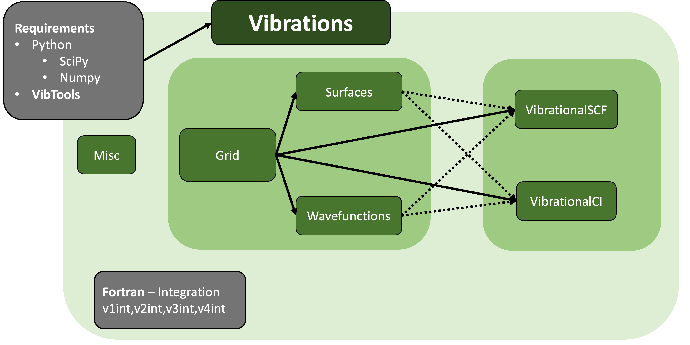

.. Vibrations documentation master file, created by
   sphinx-quickstart on Tue Nov  8 09:15:44 2022.
   You can adapt this file completely to your liking, but it should at least
   contain the root `toctree` directive.

========
Overview
========

.. mdinclude:: ../README.md

==================
User Documentation
==================

Here we find installation instructions and examples of use.

.. toctree::
   :maxdepth: 2
   :caption: Getting Started

   installation
   verify_installation

.. toctree::
   :maxdepth: 2
   :caption: Examples

   examples
   example1
   example2
   example3
   example4
   example5

==================
Code Documentation
==================

Here we find the code documentation.

.. toctree::
   :maxdepth: 2
   :caption: vibration's modules

   Grid
   Surface
   Wavefunctions
   VibrationalSCF
   VibrationalCI
